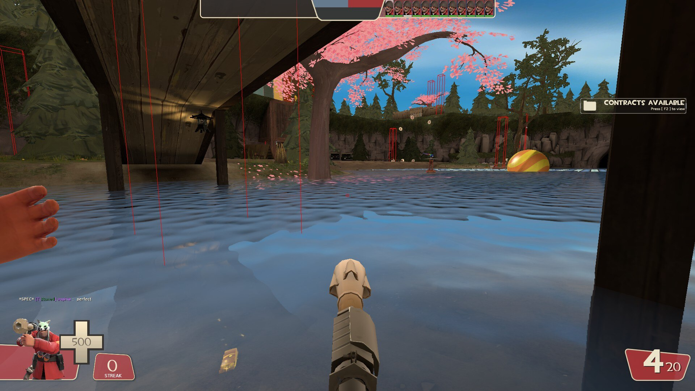

# Scripts for visualizing secret collectibles across the map Jump Academy 2
Put your generated scripts in the `steamapps/common/Team Fortress 2/tf/cfg` folder \
and run them in-game with `exec <script name>`

The scripts need a .vmf file of the map, so you'll need to manually decompile them

# In-game images

Show gold ingots

Show parrots

Show waypoints
